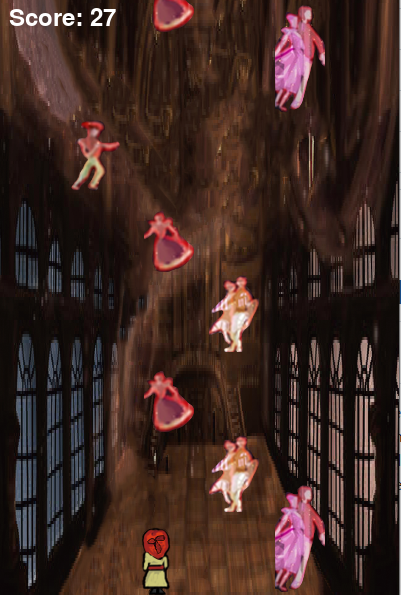
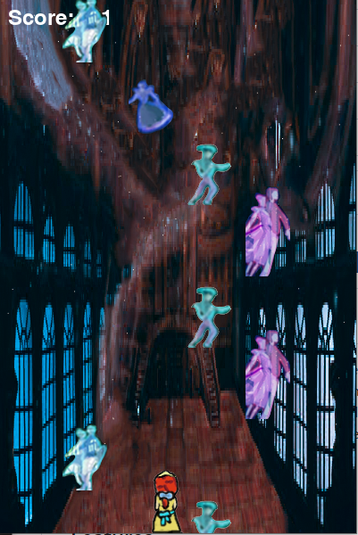

# Final-project: Piano Tile Game

## Overview

This is a Piano Tile Game that has been created for the purpose of "Introduction to Visual Media Programming" course in Sogang University 2023-2.
It is a simple arcade-style game built using the Pygame library in Python. The theme of the game is from the movie/musical "Anastasia". The game involves a player navigating 'Anastasia' to meet the falling dancers corresponding to the music "Once Upon A December" (Main theme song from the movie/ musical)


## Features

- Dynamic change on the player skin, falling dancers and background based on the music and the story of the original movie.
- Scoring system based on whether the player has successfully met the falling dancers.
- Changes in music volume based on whether the player has met the dancers. (when Anastasia is far away from the tile, the music turns to mute)

## Table of Contents

- [Installation](#installation)
- [How to Play](#how-to-play)
- [Gameplay Screenshots](#gameplay-screenshots)


## Installation

1. Clone the repository:

    ```bash
    git clone https://github.com/klee4297/final-project
    ```

2. Navigate to the project directory:

    ```bash
    cd final-project
    ```

3. Install the required dependencies:

    ```bash
    pip install pygame
    ```

4. Run the game:

    ```bash
    python pianotile1227_20201109.py
    ```

## How to Play

- Use the left and right arrow keys to move the player character.
- Hit falling tiles with the player character to score points.
- The game dynamically adjusts background and gameplay elements based on progress.


## Gameplay Screenshots




